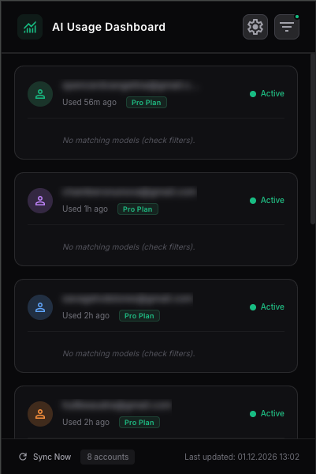
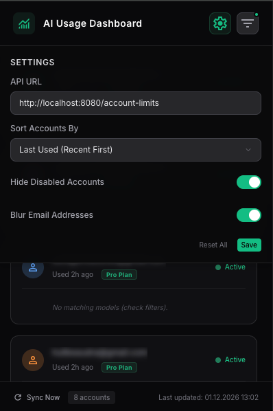
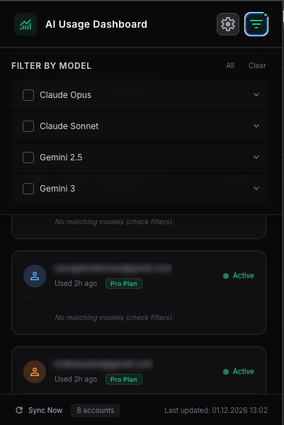
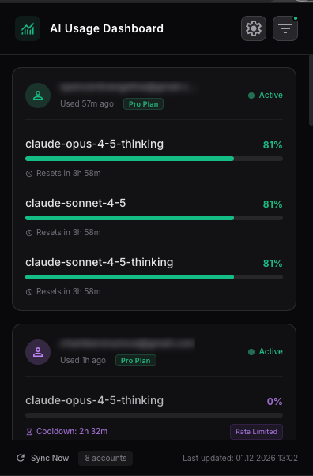

# Antigravity Limit Tracker

Chrome extension for [Antigravity Claude Proxy](https://github.com/badrisnarayanan/antigravity-claude-proxy). Displays real-time API usage limits.


## Features

- Multi-account tracking
- Model filtering (Claude, Gemini, GPT)
- Sorting by account ID, last used, or remaining limit
- Configurable API URL
- Rate limit alerts with cooldown timer
- Pro/Free plan detection
- Disabled account detection and filtering
- Email blur for privacy
- Persistent settings

## Screenshots

| Account List | Settings | Filter | Filter Active |
|:---:|:---:|:---:|:---:|
|  |  |  |  |

## Installation

1. Clone the repository:
   ```bash
   git clone https://github.com/YasinKose/antigravity-limit-tracker.git
   ```

2. Open `chrome://extensions/`

3. Enable "Developer mode"

4. Click "Load unpacked" and select the project folder

## Prerequisites

[Antigravity Claude Proxy](https://github.com/badrisnarayanan/antigravity-claude-proxy) must be running on `http://localhost:8080` (configurable in settings).

Verify:
```bash
curl http://localhost:8080/account-limits
```

Expected response:
```json
{
  "totalAccounts": 2,
  "timestamp": "2024-01-15T10:30:00Z",
  "accounts": [
    {
      "email": "user@example.com",
      "status": "ok",
      "enabled": true,
      "subscription": { "tier": "pro" },
      "lastUsed": "2024-01-15T10:00:00Z",
      "limits": {
        "claude-sonnet-4-20250514": {
          "remainingFraction": 0.85,
          "resetTime": "2024-01-15T14:00:00Z"
        }
      },
      "modelRateLimits": {
        "claude-sonnet-4-20250514": { "isRateLimited": false }
      }
    }
  ]
}
```

## Settings

| Option | Description |
|--------|-------------|
| API URL | Proxy server endpoint |
| Sort Accounts By | Account ID, Last Used, or Avg Remaining |
| Hide Disabled Accounts | Filter out accounts with `enabled: false` |
| Blur Email Addresses | Blur emails for privacy (hover to reveal) |

## Account States

| State | Condition | Visual |
|-------|-----------|--------|
| Active | `status: "ok"` and `enabled: true` | Green dot |
| Disabled | `enabled: false` | Gray, muted |
| Invalid | `isInvalid: true` | Red, error icon |
| Offline | `status !== "ok"` | Gray dot |

## Model Groups

| Group | Pattern |
|-------|---------|
| Claude Opus | `claude.*opus` |
| Claude Sonnet | `claude.*sonnet` |
| Claude Haiku | `claude.*haiku` |
| Gemini 2.5 | `gemini.*2.5` |
| Gemini 3.5 | `gemini.*3.5` |
| Gemini 3 | `gemini.*3` |
| GPT-4 | `gpt-4` |
| GPT-3.5 | `gpt-3` |

## Color Coding

| Remaining | Color | Status |
|-----------|-------|--------|
| >= 70% | Green | Healthy |
| 30-69% | Amber | Warning |
| < 30% | Red | Critical |
| Rate Limited | Purple | Cooldown |

## Technical Details

- Manifest Version: 3
- Permissions: `storage`
- Host Permissions: `http://localhost:*/*`
- API Timeout: 3 seconds

## Development

```bash
# Install dependencies
npm install

# Build CSS
npx tailwindcss -i ./src/styles.css -o ./styles.css --minify

# Watch mode
npx tailwindcss -i ./src/styles.css -o ./styles.css --watch
```

## Project Structure

```
├── manifest.json        # Extension manifest (v3)
├── popup.html           # Popup HTML
├── popup.js             # Main logic
├── styles.css           # Compiled CSS
├── src/styles.css       # Source Tailwind CSS
├── tailwind.config.js   # Tailwind config
└── icons/               # Extension icons
```

## License

MIT
